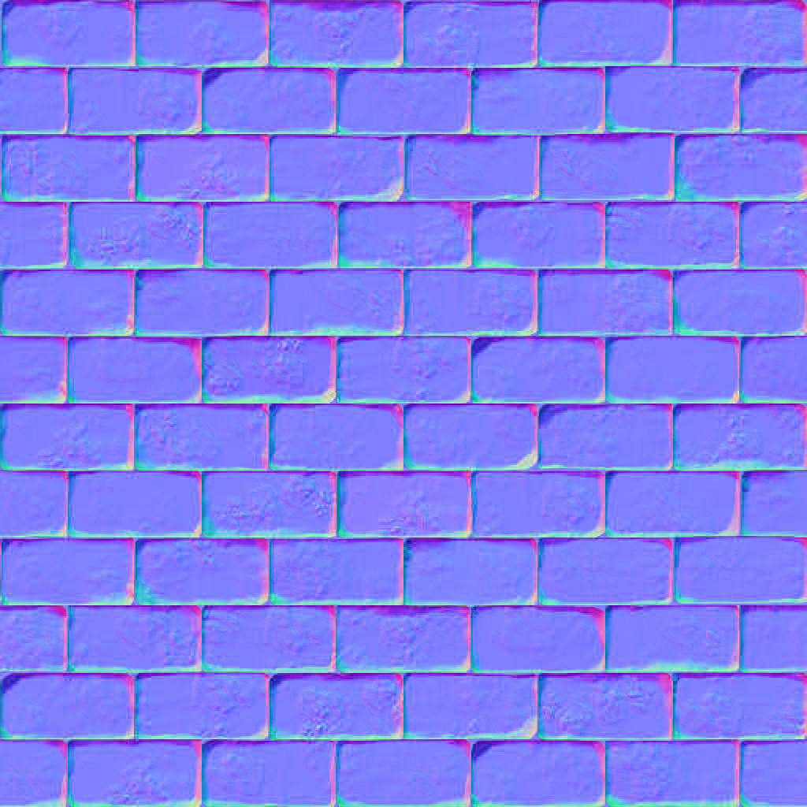

## Textures
With the skills you have learnt about so far, you should feel comfortable enough to create simple scenes.
Now while this is exciting, a game where every object is the exact same colour and texture doesn't make for a very good game.
Luckily, the L-SIM Engine makes adding textures extremely simple.
To begin select the mesh you want to add a texture to. Then selected the `useTexture` checkbox to tell the engine that you want to use a texture for this mesh.
Your mesh should now turn black, don't worry this is normal and expected. You should now also see 3 new fields `Add Texture`, `Add Specular Map`, and `Add Normal Map`.
All three of these function the same:
* First click on the add button. This will open a file dialog.
* Next select the file you want.
* Then you are done.

If everything went well you should see your texture on the mesh.

### What if I want to use a flat colour?
To use a flat colour: 
1. uncheck `useTexture`
2. Navigate to the `Mesh Colour` setting.
3. select your chosen colour.
4. Done.

This is one of the beauties of the L-SIM Engine, to add textures and colours, unlike some other engines—which may have to navigate through complex UI, in L-SIM it's as simple as pressing three buttons.

### How can I change light settings?
When it comes to light, we have already discussed creating, deleting, and moving lights, but have not yet discussed other features.
In L-SIM **as of v1.0** lights have 3 properties: Position (which we have already discussed), Light Colour, and Attenuation.
To edit these first open the **Light Settings** panel, then these options will become visible.
While it should be obvious what light colour does, attenuation is a bit more unclear, but simple put, **Attenuation** is the range of the light thus a high attenuation value will result in a light with a greater radius.

**EDITOR'S NOTE:** _Attenuation is **not** the intensity of the light, but instead the radius. This means a higher attenuation value will **not** make the light brighter on pixels already inside the radius._

**EXTRA INFORMATION (on the different map types):**

_As of **v1.0** the L-SIM Engine supports 2 types of maps on meshes, these being specular maps and normal maps.
Both of these maps are extremely common in the 3D space, but I will describe them incase you don't know what they do._
#### _1. Specular Maps_
_Specular maps are responsible for the shiny/reflective effect on meshes. Specular maps are often use on metallic parts of meshes and glossy surfaces.
A specular map is a black and white image where whiter parts reflect more light._

**EXAMPLE OF SPECULAR MAP FOR WOOD PLANKS**

_Credit: Texture by [@samuliak](https://medium.com/@samuliak/apples-metal-api-tutorial-part-6-camera-movement-14f2c015a2da) on medium_

#### _2. Normal Maps_
_Normal maps are responsible for adding surface details to textures based on light direction. This is **not** shadows from others meshes but are shadows caused by the texture.
Normal maps are often used in textures with crevasses such as brick walls, tiled floors or wooden panels.
Normals maps are textures with a distinct purple colour where X is a red colour, Y is a green colour and Z is a blue colour.
The purple colour is the most common as most normals will face outwards with $Z \approx 1$ while normals near gaps will be more red or green as they face along the XY plane._

**EXAMPLE OF NORMAL MAP FOR A BRICK WALL**

_Credit: Texture from [Learn OpenGL](https://learnopengl.com/Advanced-Lighting/Normal-Mapping)_

**ANOTHER EDITOR'S NOTE:**
_It is actually possible to apply a normal map, and or a specular map to a flat colour mesh.
To do this:_
* _first select `useTexture`_
* _Add your desired maps_
* _Deselect `useTexture`_
* _The mesh should still now have the maps_

_This technique can be useful to add extra detail to solid colour meshes. 
Also, if you ever want to remove a map you can select `useTexture` then click on remove map for the maps you want gone._

**EXTRA INFORMATION (about file storage):**
_When you and a texture or map, the file is stored inside the resources directory, this is turn means that you can delete the original texture from `downloads` or where ever it was stored.
This also means **as of v1.0** you cannot organize files inside of resources (as the engine won't be able to find them) although we hope that eventually that the resources directory will automatically sort files by use._

